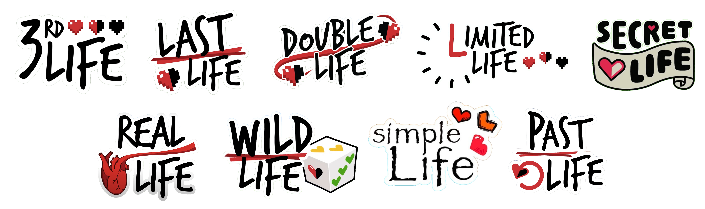

# Life Series Mod

This mod is a one-to-one recreation of [Grian](https://www.youtube.com/c/Grian)'s Life Series in Minecraft Fabric.

It adds everything from the original series, along with an incredible amount of quality of life features, and endless customizability.

-----

### [Wiki](https://mat0u5.github.io/LifeSeries-docs)
All documentation about this mod is available on the [Life Series Mod Wiki](https://mat0u5.github.io/LifeSeries-docs)

### [Discord](https://discord.gg/QWJxfb4zQZ)
Have questions, suggestions or bug fixes? Join the [Life Series Mod Discord server](https://discord.gg/QWJxfb4zQZ) to give feedback and connect with others!

-----

## Feature Complete
This mod faithfully recreates all the seasons of the Life Series - everything works exactly as in the originals.

| Third Life | Last Life | Double Life | Limited Life | Secret Life | **Wild Life** | Past Life | **Nice Life** |
|------------|-----------|-------------|--------------|-------------|---------------|-----------|---------------|
| Completed  | Completed | Completed   | Completed    | Completed   | Completed     | Completed | Completed     |

All in a single mod. No more shady, unmaintained, buggy datapacks.

## Customizable
A big part of this mod that it is very customizable.

There are over 100 customizable features, including default lives, boogeyman in any season, custom item blacklists, players subbing in, and much more.

## Requirements
[Fabric API](https://modrinth.com/mod/fabric-api) is required to run this mod, there are no other mod dependencies - although [Simple Voice Chat](https://modrinth.com/plugin/simple-voice-chat) is recommended.

The mod is server-side required and optional client-side.

#### Client-side features
While having the mod client-side is not required, having it adds a lot of cool features, such as:
- Colored hearts based on lives.
- Integrated session timer.
- Custom GUIs for managing the config.